### Hi there 👋
- 🔭 I’m currently working on Tecnical Suport
- 🌱 I’m currently learning Fullstack web and mobile and computer enginner

<picture>
  <source media="(prefers-color-scheme: dark)" srcset="https://raw.githubusercontent.com/EliasIsac/EliasIsac/output/pacman-contribution-graph-dark.svg">
  <source media="(prefers-color-scheme: light)" srcset="https://raw.githubusercontent.com/EliasIsac/EliasIsac/output/pacman-contribution-graph.svg">
  
</picture>

<table style="border: 2px solid #30363d; border-radius: 15px; background-color: #0d1117; width: 80%; box-shadow: 5px 5px 15px rgba(0,0,0,0.3);">
      <td style="padding: 20px; text-align: center; border-right: 1px solid #30363d; width: 30%;">

  <h3 style="color: #c9d1d9;">Estatísticas de EliasIsac</h3>
  

</table>

### Frontend  

 
 
  
  
  
  

</td><td valign="top" width="33%">
 

### Backend  

  
    
  
  
  
 
  
  
  

</td><td valign="top" width="33%">

<picture>
  <source media="(prefers-color-scheme: dark)" srcset="https://raw.githubusercontent.com/maurodesouza/maurodesouza/output/pacman-contribution-graph-dark.svg">
  <source media="(prefers-color-scheme: light)" srcset="https://raw.githubusercontent.com/maurodesouza/maurodesouza/output/pacman-contribution-graph.svg">
  
</picture>

|Cursos | Certificados|
|-------| -------------|
|| |
||  

<h3 align="left">Conecte-se comigo:</h3>

<!--
**Eliasisac/Eliasisac** is a ✨ _special_ ✨ repository because its `README.md` (this file) appears on your GitHub profile.

Here are some ideas to get you started:

- 🔭 I’m currently working on ...
- 🌱 I’m currently learning ...
- 👯 I’m looking to collaborate on ...
- 🤔 I’m looking for help with ...
- 💬 Ask me about ...
- 📫 How to reach me: ...
- 😄 Pronouns: ...
- ⚡ Fun fact: ...
-->
